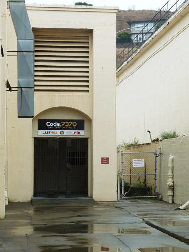
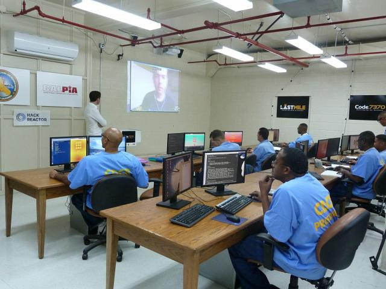
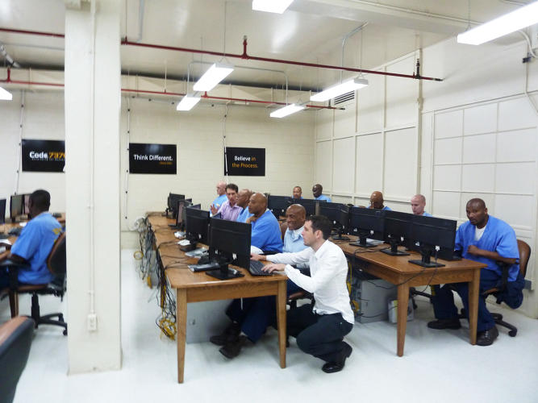

#Coding in Prison
CSC 350  
Final Project  
Isaac Meisner

##Code.7370
Launched in October 2014, San Quentin State Prison in California and the Last Mile Program created **Code.7370**, which is a program that trains prisoners in computer programming.

This program is in partnership with Hack Reactor and the California Prison Industry Authority.

"7370" refers to the *Standard Industrial Classification Code* that would appear in a company's Securities and Exchange Commission filings to designate what the company does, where 7370 refers to Computer Programming.

##San Quentin State Prison
* Oldest prison in California
* Largest death row in the US
* Holds only male prisoners
* Known for conducting executions
* Has held notorious criminals like Charles Manson

##Prisoners in Code.7370
* These men and women are selected based on their ability and motivation to learn computer programming, 
rather than on their past experience as many of them have no experience using a computer or mobile phone.
* Some of these prisoners were incarcerated before the internet, mobile phones, and computers were popular.

##Common Jobs in Prison
Most prisoners do jobs like cooking, cleaning, clerical work, and running laundry.
Some prisons have manufacturing facilities that allow the prisoners to work on making signs and license plates, making furniture, sew, process food, or do metal fabrication.

Meanwhile, these 18 prisoners are doing something we enjoy and are paying money to learn. 

I thought they were in prison?

##Goal of Code.7370
The purpose of this program is to break the cycle of incarceration.

They claim that this program is entrepreneurship training for the prisoners so they can obtain a job when they are released from prison.

##Training
These classes are modeled off of Hack Reactor's bootcamp

The program is 6 months and the prisoners work four days a week for eight hours learning HTML, CSS, and Javascript.

This training includes:

* teaching of basic computer literacy
* guidance through software and web development, JavaScript, and an array of computer programming tools
* problem solving skills

##Classroom
Their classroom contains refurbished state computers running Ubuntu that contain a small subset of the internet, which simulates a coding environment for the prisoners. All their work is saved locally on the computers.

They are lectured to by software developers, mostly by Google Hangout, and take notes from software developers that volunteer their time to teach them.

Most lectures from the instructors are via Google Hangout

##Reservations?
What are the risks of teaching criminals how to program?

Are prisoners the best crowd of people to focus teaching to?

* Probability of coding success
* Viruses
* Waste of teaching efforts?
* Likelihood of being hired

***"If you can write great code, people don't really care about anything else."*** -Chris Redlitz (Founder of The Last Mile)

##Benefits?
* Prisoners are taught skills that are more applicable to today's world
* They are given the opportunity to be creative
* Less blue collar work when out of prison

##Do you think this program will be successful?
Programming is becoming more popular and will become competitive as the years go by. By the time prisoners are out of prison and have completed this program, I don't think they will be able to compete with the younger programmers earning educations in school. 

##Final Thoughts
This is a fairly new program and this is the first group of men to do the program. It will be interesting to see how these men do after being released from the prison. I think that this program is great and love that it teaches people how to code. I do have some doubts at the success rate of these prisoners when they get out. I feel they find coding to be difficult and may want to go back to their old bad habits.

